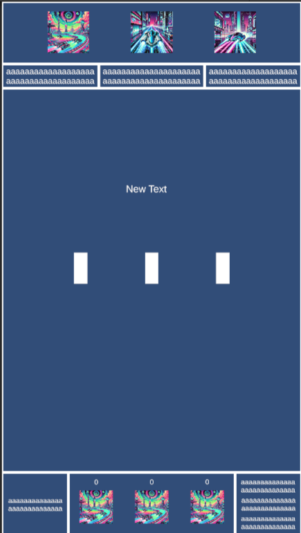
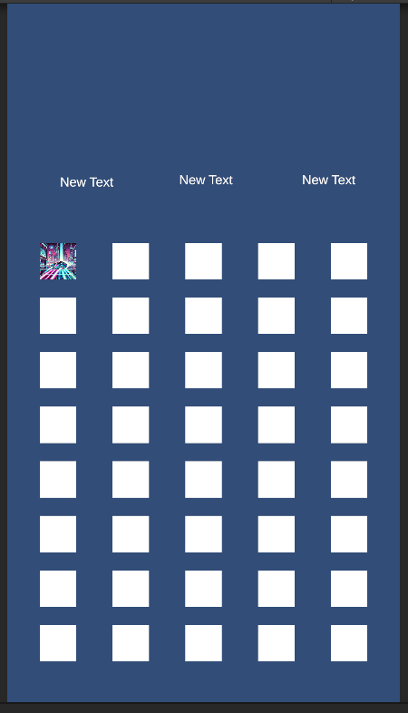

# TikTok Live Arena (Unity)

> An early Unity project, an interactive game built end-to-end as a vehicle for learning real-time event-driven game design: the TikTok Live API pipeline, donator-based player selection, chat voting with deduplication, a multi-state game flow, dynamic multi-target camera, weighted roulettes and local persistence. The game itself was built around the format that was trending at the time (interactive TikTok Live streams where viewers become the participants), I picked an established format on purpose so I could focus on the live-event integration, not on inventing a genre. Uploaded essentially as-is, an honest snapshot of where I was as a Unity developer at the time.

<p align="center">
  
  
</p>

## About this repository

This was an early Unity project. The goal wasn't to design an original game, it was to walk the full pipeline of a TikTok-Live-integrated build once, without skipping any step: connecting to a live stream from Unity, mapping gift events to in-game state, ranking viewers by their donations, promoting the top donators into actual playable characters, parsing chat messages as votes inside timed windows, and feeding all of that into a state machine that drives a vertical race with dynamic camera and a victory-persistence layer. To keep the focus on the live-event integration and not on inventing a genre, I picked the format that was already working on TikTok at that moment (interactive streams where the chat decides what happens) and built that. The format was a solved problem; the integration wasn't.

I finished the game, it ran end-to-end against a real TikTok Live stream, and I left it there. I never streamed with it publicly more than as a test.

**It's uploaded essentially as-is**, because this repo isn't here to showcase "clean code". It's here to show two things:

- that I shipped a complete real-time game wired to an external live-event API, with the full feedback loop closed (gift in → state change on screen),
- and that today I can look at this code with a critical eye and tell you exactly what's wrong with it.

That second part is documented below, in [Technical debt and decisions I'd revisit](#technical-debt-and-decisions-id-revisit) and [What I'd do differently today](#what-id-do-differently-today).

## What's inside

### The game

Vertical race for three players, the three players being the top three donators of the current TikTok Live session. While the race is on, the rest of the chat votes power-ups in real time by typing `1`, `2`, or `3` (or `1/2`, `2/3`, `3/1` in pair-mode). The cleanest 10-second window of votes wins and that boost is applied. Lose all your runners, the last one alive takes the round, victory count gets persisted to disk, and a new waiting room opens for the next batch of donators.

Four game states (`State1`–`State4`) driving the full session: a 30-second waiting room collecting donators until at least three are present, a race where the top 3 are promoted to actual GameObjects and the chat votes boosts, a victory screen with persistent win counts, and an image-selection mini-game where the top donators each pick an option by typing `1` or `2` in chat. A debug-mode `1` key simulates a random gift so you can test without going live.

The mechanics worth pointing out:

- **Colour-aware? No, this one's vote-aware.** A vote only counts if the viewer hasn't voted yet in this window. `HashSet<string> usersWhoVoted` enforces it. After the timer expires, the leading option wins and its effect is applied via a `switch` in `GameManager.ApplyEfect()`.
- **Dynamic multi-target camera.** `CameraFollow2D` keeps all active players framed. As they separate vertically, the orthographic size lerps between `minSize` and `maxSize`. When only one player remains, it zooms in on them. Players get added back to the target list automatically if they're reactivated, removed automatically when they're disabled.
- **Roulettes with weighted probabilities.** `RuletaJugador.SeleccionarImatgesTriades()` picks N images from a weighted pool, then `RotarImatges` cycles through them at decreasing speed until it stops on the final one. The deceleration is `Mathf.Lerp(velocitatInicial, 0.5f, percentatgeCompletat)` over a randomized duration, which gives the "wheel slowing down" feel without any tween library.
- **Victory persistence as a real save layer.** `VictoryManager` keeps a `List<PlayerData>` (name, win count) serialized between sessions. When a player wins, their entry is incremented or created; the winner screen displays "Name — Victories: N" with the updated count. Persistent identity across sessions, anchored to the TikTok nickname.

### The TikTok Live integration

The part of this repo I actually learned from.

- **The full event pipeline closed.** `TikTokLiveBasicInfo.cs` initializes a `TikTokLiveManager` (creating one and `DontDestroyOnLoad`-ing it if none exists), subscribes to `OnConnected`, `OnRoomUpdate`, `OnChatMessage`, `OnFollow`, `OnGift`, and calls `ConnectToStreamAsync(hostUsername)`. Each event fires a real handler that mutates real game state, gift in becomes donator-list update becomes top-3 reranking becomes UI update becomes (eventually) "this user is now a player on screen". The whole loop from TikTok server to in-game GameObject is closed.
- **Donations as ranking, ranking as casting.** Donators are stored in a `List<Donator>`, ordered descending by points. The top 3 by `DiamondCost` become the three player slots, their TikTok nicknames are written into `TextMeshProUGUI` labels and their pictures travel with the GameObjects on screen. The economic action (sending a gift) is mapped directly to the social action (becoming the protagonist), which is the entire point of the format.
- **Chat voting with dedup and window timers.** `ChatMessageAnalyzer.HandleChatMessage` filters incoming messages against a per-window `HashSet<string>` so each viewer only counts once, validates the message against a dynamic options list (`{"1","2","3"}` or `{"1/2","2/3","3/1"}` depending on `dataManager.resultatRuleta2`), and tallies into `count1` / `count2` / `count3`. The window itself is a coroutine, `AnalyzeChatForDuration(10)`, that decrements a countdown text on screen and resolves the winner at the end.
- **Filter pass on incoming messages.** Before any chat message reaches the on-screen banner of a top donator, it's checked against a `bannedWords` array, hits get replaced with `"Missatge anul·lat"`. Cheap and effective.
- **Simulation mode.** `SimulateGift()` generates a synthetic donator with a random gift and random point value when you press `1`. The same code path that processes real `OnGift` events processes simulated ones, so the game can be developed and demoed without anyone actually being live.
- **A state machine for the broadcast itself.** `GameManager.GameState` (`State1`–`State4`) gates which HUD is active (`hudState1`–`hudState4`), which behaviours run, when the camera follows whom, when the roulette spins, when donator messages fade in over their nameplates. `TikTokLiveBasicInfo` listens for state transitions and freezes the Top-3 list on entry to `State2` so the players for the round are locked in before the race starts.

## How to build it

You'll need:

- **Unity 2022.3 LTS or later** (open `ProjectSettings/ProjectVersion.txt` to check the exact version I used).
- **TikTokLiveSharp + TikTokLiveUnity**, not bundled, see below.
- A real TikTok account that's currently live, or the simulation key.

After cloning:

1. Open the project in Unity. Let it import.
2. **Import TMP Essential Resources** when prompted (`Window → TextMeshPro → Import TMP Essential Resources`). TMP fonts and shaders aren't in the repo because they're a Unity package.
3. **Install TikTokLiveSharp and TikTokLiveUnity.** Download the latest release of [TikTokLiveSharp](https://github.com/frankvHoof93/TikTokLiveSharp) and its Unity wrapper [TikTokLiveUnity](https://github.com/frankvHoof93/TikTokLiveUnity), and import them as Unity packages. They wrap the (undocumented) TikTok Live WebSocket protocol; this whole project hangs off the events they expose (`OnGift`, `OnChatMessage`, `OnRoomUpdate`, `OnFollow`, `OnConnected`).
4. **Set your TikTok host username.** Open the `Menu` (or `Game`) scene, select the GameObject carrying `TikTokLiveBasicInfo`, and set the `hostUsername` field in the Inspector to your TikTok @ (no leading `@`). This is the account whose live stream the build will subscribe to. It has to be live at the moment you press Play, or `ConnectToStreamAsync` will fail.
5. Build target stays at PC, Mac & Linux Standalone. The game runs on your machine and you screen-capture it into TikTok via OBS (or equivalent), it doesn't run inside TikTok.

To play without a live audience, run the build and use the debug keys below to drive the state machine manually and simulate gifts.

## Controls

The game is played by the audience through the TikTok Live chat. The streamer's keyboard exists only to drive debug and state transitions.

### Audience (via TikTok chat)

| Action | Input |
|---|---|
| Become a player | Send a gift while the waiting room is open. Top 3 by total diamond cost become the racers. |
| Vote a boost | Type `1`, `2`, or `3` (or `1/2`, `2/3`, `3/1` in pair-mode) in chat during the 10-second voting window. One vote per viewer per window. |
| Pick an image (mini-game) | If you are a top donator during `State4`, type `1` or `2` to assign your image. |

### Streamer (keyboard, for debug and manual flow)

| Action | Input |
|---|---|
| Simulate a random gift | `1` |
| Force-transition to State2 (race) | `2` |
| Force-transition to State4 (image mini-game) | `3` |
| Force-transition to State3 (victory screen) | `4` |
| Force-transition to State1 (waiting room) | `5` |
| Kill player 1 / 2 / 3 manually | `7` / `8` / `9` |
| Start a chat-voting window | `S` |

## Project structure

```
Assets/
├── aa.cs                          # Empty default script, see Technical debt
├── CameraFollow.cs                # Legacy multi-target camera (unused)
├── CameraFollow2D.cs              # Active 2D multi-target camera with dynamic zoom
├── ChatMessageAnalyzer.cs         # Vote tallying with dedup and window timers
├── DataManager.cs                 # Shared mutable state (roulette results, positions)
├── DonatorMovement.cs             # Tiny helper, four-directional nudges
├── GameManager.cs                 # State machine, win detection, scene flow
├── ImageController.cs             # Image-mini-game per-slot logic
├── ImageControllerManager.cs      # Static façade for image-mini-game timing
├── MoveForward.cs                 # Player movement and boost handling
├── RuletaJugador.cs               # Per-player weighted roulette
├── TikTokLiveBasicInfo.cs         # TikTok Live event subscription and donator ranking
├── TopDonatorsDisplay.cs          # Stub, see Technical debt
├── VerticalRoulette.cs            # Roulette variant
├── VerticalRoulette2.cs           # Near-identical to VerticalRoulette
├── VerticalRoulette3.cs           # Near-identical to VerticalRoulette
├── VerticalRoulettePlayers.cs     # Near-identical to VerticalRoulette
└── VictoryManager.cs              # JSON persistence of win counts
ProjectSettings/
Packages/
```

`Assets/TikTokLiveSharp/`, `Assets/TikTokLiveUnity/` and `Assets/TextMesh Pro/Examples & Extras/` are intentionally **not** in the repo, they're third-party content that you bring in via the [How to build it](#how-to-build-it) steps above. Keeping them out makes the repo focused on the code I actually wrote.

## Technical debt and decisions I'd revisit

I've reviewed this with hindsight. I'm listing the issues not to make excuses, but to make the point that **I can identify them now**, which is the actual skill that matters.

- **Four near-identical roulette classes.** `VerticalRoulette.cs`, `VerticalRoulette2.cs`, `VerticalRoulette3.cs` and `VerticalRoulettePlayers.cs` differ in a handful of fields and a few conditionals. This should be a single `Roulette` class taking its configuration (image set, weights, target action) as a serialized field or, better, a `ScriptableObject`. Copy-paste was the wrong tool, every time I tweaked the deceleration curve I had to change it in four files.
- **The result switch in `RuletaJugador.AccioSegonsResultat` has three identical branches.** `case "Imatge1"`, `"Imatge2"` and `"Imatge3"` execute the exact same code (increment counter, apply boost to everyone when full). The branches should collapse to a single block, or the logic should move into a small data-driven table mapping result name → effect.
- **Two separate scripts both subscribing to `OnChatMessage`.** `TikTokLiveBasicInfo` and `ChatMessageAnalyzer` each call `liveManager.OnChatMessage += ...` from their own `Start`. Worse, both call `ConnectToStreamAsync` at startup, the second one connects to the literal string `"hostUsername"` (a clear typo, the field reference was lost). Result: duplicated handler chains and a phantom connection attempt to a non-existent user. The integration should expose a single broadcaster that the rest of the game subscribes to, not have every script re-subscribe to the SDK directly.
- **`StopAllCoroutines()` is too blunt.** `ShowMessageWithFade` calls it to cancel a previous fade, which also kills any other coroutine running on the same MonoBehaviour, including the chat-window countdown if I ever moved things around. The correct pattern is `StopCoroutine(handle)` on a specific reference.
- **`Debug.Log(jugador1name)` in `GameManager.Update`.** Every frame. Forever. Left over from a debug session that never got cleaned up. The kind of line that costs nothing in isolation and a lot when accumulated across all the other `Debug.Log` calls scattered through the project.
- **`aa.cs` is the empty default Unity script.** It's the unmistakable trace of "I created a new script, never used it, never deleted it." Embarrassing on first impression, honest about how the project was built.
- **`TopDonatorsDisplay.cs` is a single line.** Was planned, never written. Same story as `aa.cs`.
- **Placeholder banned words shipped as-is.** The `bannedWords` array contains `"uwu"`, `"paraulota2"`, `"paraulota3"`. Numbered placeholders that never got replaced with real banned words. The filter works, the list doesn't.
- **`FindObjectOfType` in hot paths.** `ChatMessageAnalyzer.GetVotingOptions()` calls `FindObjectOfType<DataManager>()` every time a vote comes in, which inside a busy chat is many times per second. The reference should be cached, ideally injected via the Inspector like every other dependency in the file.
- **Tight coupling between `GameManager`, `DataManager`, `TikTokLiveBasicInfo` and `VictoryManager`.** They each hold direct references to the others, and several flows reach in to read or mutate fields directly (`tikTokLiveBasicInfo.donatorList.Count`, `dataManager.posicióJugador1`, etc.). Renaming or moving any one of them is a multi-file change. The natural seam is an event bus or, less ambitiously, a single `MatchState` object the others read from.
- **Identifiers and inspector strings are in Catalan, sometimes with accents.** `posicióJugador1`, `jugadorsRestants`, `Resultat jugador: ...`, `Esperant mínim 3 donadors...`. The code itself (class names, method names, Unity API surface) is in English, but everything I wrote on top of it is in Catalan. I left this as-is. Translating it would be cosmetic and a layer of dishonesty about when and where this was built. Accented identifiers were a bad idea regardless of language, and I'd avoid them today.
- **`hostUsername` is set per-scene in the Inspector.** Should be a `ScriptableObject` config (`StreamConfig`) referenced by both scenes, or read from a config file at runtime, so the streamer doesn't have to remember to update two places.

## What I'd do differently today

If I were rewriting this from scratch:

1. **A single broadcaster sitting between the TikTok SDK and the rest of the game.** One `TikTokEventBus` MonoBehaviour subscribes to the SDK once, normalizes the events (`GiftReceived`, `ChatMessage`, `Follow`, `RoomUpdate`) and re-emits them as C# `event`s or UniRx streams. Nobody else touches `TikTokLiveManager` directly. This kills the duplicate-subscription class of bug entirely.
2. **One `Roulette` class, configured by `ScriptableObject`.** Each roulette variant becomes a `RouletteDefinition` asset (image set, weights, deceleration curve, duration range, on-result action). The four `VerticalRoulette*` files collapse to one. Creating a new roulette is "right-click → Create → Roulette Definition", not "duplicate the file, rename, modify".
3. **Match state as plain data, not as MonoBehaviour fields.** A `MatchState` class holding `currentState`, `donators`, `racers`, `votingWindow`, `winnerHistory`. MonoBehaviours render from it, never own it. State transitions happen in pure functions that are testable without Unity. The current "every system mutates every other system's fields" pattern goes away.
4. **A reconnection layer.** `ConnectToStreamAsync` is called once in `Start` and never retried. If the WebSocket drops mid-stream (which it does), the game stops receiving events and the streamer has to restart the build. A small reconnect-with-backoff wrapper would handle the network blips that are part of how TikTok Live actually works.
5. **Persistence as a single serialized JSON, not scattered `PlayerPrefs`-style writes.** `VictoryManager` already writes a list, but other state (`hostUsername`, ban list, gift→points overrides) is configured inline or hardcoded in dictionaries. A single `Config.json` for static config, a single `Save.json` for run-to-run state.
6. **A debug overlay built on the same event bus, not key shortcuts in `Update`.** Right now state transitions and gift simulation hang off `Input.GetKeyDown` calls inside game logic. They should be a separate `DebugPanel` that listens to the bus and emits synthetic events into it. Testing the game without going live becomes one entry point instead of a list of hotkeys you have to memorise.
7. **Tests around the pure logic**, donator ranking, voting tally with dedup, the win-condition detection in `GameManager.Update`. None of this requires Unity to test if it were separated from the MonoBehaviours, which is what point 3 unlocks.

None of this is going to be applied to this repo. It is what it is, and that's the point of keeping it public.

## Stack

- **Engine:** Unity (2022.3 LTS or later, check `ProjectSettings/ProjectVersion.txt`)
- **Language:** C#
- **Platform:** PC standalone (the build runs on the streamer's machine, captured into TikTok via OBS)
- **Live integration:** [TikTokLiveSharp](https://github.com/frankvHoof93/TikTokLiveSharp) + [TikTokLiveUnity](https://github.com/frankvHoof93/TikTokLiveUnity)
- **UI:** Unity UGUI + TextMesh Pro
- **Persistence:** JSON via `VictoryManager`

## Third-party

The code is mine. The external dependencies are:

- **[TikTokLiveSharp](https://github.com/frankvHoof93/TikTokLiveSharp)** and **[TikTokLiveUnity](https://github.com/frankvHoof93/TikTokLiveUnity)** by Frank van Hoof, the C# library and Unity wrapper that connect to the TikTok Live WebSocket protocol. Not bundled in this repo to keep it focused on my code, you install them yourself during [How to build it](#how-to-build-it). Check the upstream repos for current licence terms.
- **TextMesh Pro**, a built-in Unity package installed automatically by the Package Manager.

### Assets

The visual assets (sprites, UI elements) were sourced from free-use packs I gathered online while building the game. I didn't keep a precise attribution list at the time, which I should have. **If you recognize an asset that has a more restrictive licence than I assumed, that I should be crediting explicitly, or that shouldn't be in this repo at all, please [open an issue](../../issues) and I'll fix it as soon as I can.**

### Note on the TikTok Live API

TikTok does not publish an official Live API. `TikTokLiveSharp` reverse-engineers the WebSocket protocol used by the web client. That makes this whole stack inherently fragile, if TikTok changes their internal endpoints, the library breaks and so does this project, until upstream catches up. Treat this repo as a snapshot of a moving target.

## License

MIT, see [LICENSE](LICENSE).

---

*If you made it this far: thanks for taking a look. If you find a bug, want to comment on the code, or just tell me how you'd have done it, open an issue. I'd genuinely love to hear about it.*